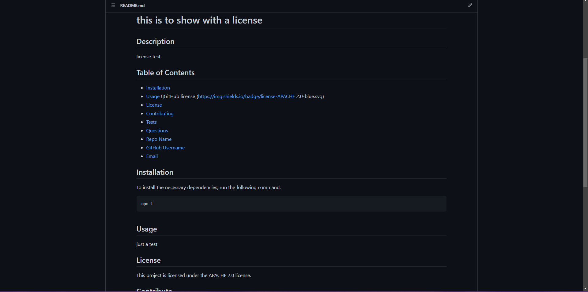

  # ReadMe-Inator

  ## Description
  
  This application allows the user to enter inputs based off of prompts to compile a README.md file. The technologies that are used in this application are Node.js and Inquirer.
  
  ## Table of Contents

  * [Installation](#installation)
  * [Usage](#usage)
  
  * [License](#license) 
  * [Contribute](#contribute)
  * [Tests](#tests)
  * [Questions](#questions)
  * [Repo Name](#repo)
  * [GitHub Username](#username)
  * [Email](#email)

  ## Image and Video of Application
  
    

  ## Deployed Link
  [title](https://renbryant.github.io/ReadMe-inator/)
  
  ## Installation
  To install the necessary dependencies, run the following command:
  
  ```
  npm i
  ```
  in the package.json file

  ## Usage
  This application will help users make a professional README without having to style and type it out themselves.
  
  ## License

This project is under no license.
  
  ## Contribute
  The Contribuutors for this project is RenBryant.
  
  ## Tests
  Test this application using node index.js in the terminal.

  ## Questions
  What application will you use this generator for?

  ### GitHub Username
  [Github User](https://github.com/RenBryant)  

  ### Repo Name
  [Github Repo](https://github.com/RenBryant/ReadMe-inator)

  ## Email
  bryantrlauren2300@gmail.com